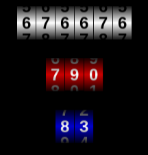
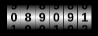
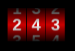

# Phaser3-analog-counter
Class to use with Phaser 3 to show numbers in a "realistic" analog counter display.  
**Try demo here**: https://jjcapellan.github.io/phaser3-analog-counter/  
<p align="center">

</p>  

## Table of contents
* [Installation](#Installation)
  * [Browser](#Browser)
  * [From NPM](#From-NPM)
* [Usage](#Usage)
* [Options](#options)
* [License](#License)

## Installation
### Browser
There are two alternatives:
* Point a script tag to the CDN link:
```html
<script src="https://cdn.jsdelivr.net/gh/jjcapellan/phaser3-analog-counter/dist/analog-counter.umd.js">
``` 
* Download the file [analog-counter.umd.js](https://cdn.jsdelivr.net/gh/jjcapellan/phaser3-analog-counter/dist/analog-counter.umd.js) to your proyect folder and add a reference in your html:
```html
<script src="localPath/analog-counter.umd.js">
``` 
Then you can access the class by the global **ShapeRec**:
```javascript
// In your create function ...
const myCounter = new AnalogCounter(this, x, y); 
```

### From NPM
```
npm install phaser3-analog-counter
```
Then you can acces the class as:
* CommonJS module
```javascript
const AnalogCounter = require('phaser3-analog-counter');

// In your create function ...
const myCounter = new AnalogCounter(this, x, y); 
```

* ES6 module
```javascript
import AnalogCounter from 'phaser3-analog-counter';

// In your create function ...
const myCounter = new AnalogCounter(this, x, y);
```

## Usage
This is the most simple use (all options by default):
```javascript
// In your scene create function ...

// Constructor only needs 3 params: (scene, x , y)
const myCounter = new AnalogCounter(this, 100, 100);

myCounter.setNumber(89091);
```
The result using all default options is:
<p align="center">

</p>  

We can change some options:
```javascript
const config = {
    digits: 3,
    backgroundColor: 0xcc0000,
    fontColor: '#ffffff'
}
const myCounter = new AnalogCounter(this, 100, 100, config);
myCounter.setNumber(243);
```  
This is the result:
<p align="center">

</p>  

To change position and object origin:
```javascript
const myCounter = new AnalogCounter(this, 100, 100);

// Same like in Phaser
myCounter.setOrigin(0.5);

// Changes position to {x:150, y:200}
myCounter.setPosition(150,200);
```
## Options
This is the config object with all options:
```javascript
interface CounterConfig {
    /**
     * Width of counter in pixels. Default: digits * (fontSize + 4)
     */
    width?: number,

    /**
     * Height of counter in pixels. Default: fontSize * 2 (max value)
     */
    height?: number,

    /**
     * Number of digits of counter. Default: 6
     */
    digits?: number,

    /**
     * Vertical space between digits in pixels. Default: fontSize/2
     */
    padding?: number,

    /**
     * CSS property "fontSize" of the font used to make the digits. Default: 24
     */
    fontSize?: number,

    /**
     * Color of font in html format (example: '#ff00ff'). Default: '#000000'
     */
    fontColor?: string,

    /**
     * Color of background in hex format (example: 0xff00ff). Default: 0xffffff
     */
    backgroundColor?: number,

    /**
     * Alpha value of shade effect. 0 disables this effect. Default 0.9.
     */
    shade?: number,
    
    /**
     * Time interval in milliseconds until reach a number. Default: 1000.
     */
    duration?: number;
}
```  
## License
This code is released under [MIT LICENSE](https://raw.githubusercontent.com/jjcapellan/phaser3-analog-counter/master/LICENSE).